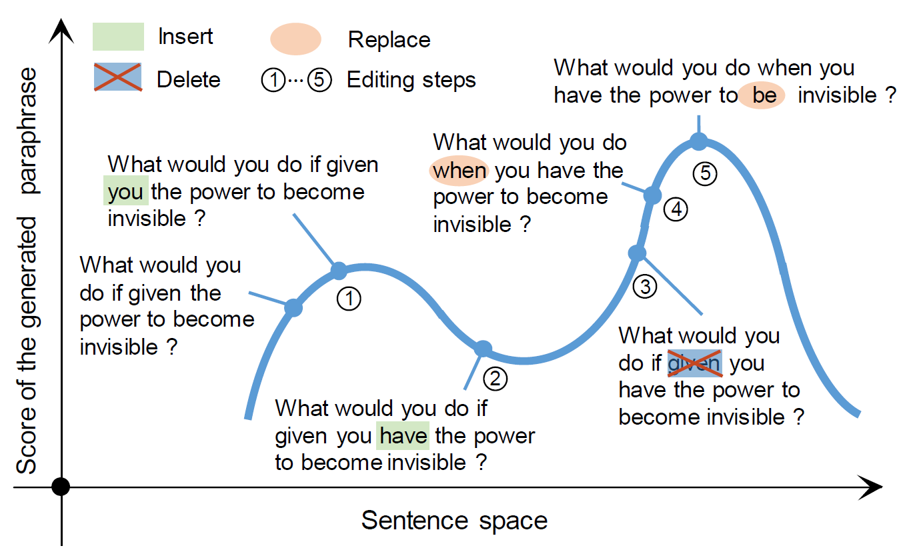

# Status

Currently the Docker packaging is sound but there is no REST API. 
After evaluating the output of UPSA, I am undecided about whether it is worth creating a REST API.
**Nevertheless, the Docker packaging is likely to be useful.**

# Fork

The purpose of this fork is to package [USPA](https://github.com/Liuxg16/UPSA) in a docker container with a REST API.
It does not appear as a fork in GitHub only because the original repo was out of quota on LFS, which made those files unavailable to forks.
LFS has been disabled in the current repo because it is problematic; 

Fork modifications are licensed as Apache 2.0; the license for UPSA is unclear.

## Docker requirements

- [nvidia-docker](https://github.com/NVIDIA/nvidia-docker)
	- See its own requirements for NVIDIA driver and Docker

## Run in Docker

- Download [POS model](https://github.com/frcchang/zpar/releases/download/v0.7.5/english-models.zip) and extract to upsa/POS/english-models
- Download [build models](https://drive.google.com/file/d/1SnYMNwIbp6lBH_Vdhm6v8KA4_11mSz8Z/view?usp=sharing) and extract to upsa/data
- docker build --tag upsa:1.0 .
- docker run -it --gpus all upsa:1.0 bash
- You can run the demo commands below via the bash session in Docker or using `vscode` to [remote debug into the container](https://code.visualstudio.com/docs/remote/containers).

## Server

File `app.py` contains a simple server using Flask for development
The Dockerfile specifies a build using [Gunicorn](https://flask.palletsprojects.com/en/1.1.x/deploying/wsgi-standalone/) for production.

---------------------------

# UPSA

# Requirement
python==2.7
cuda 9.0
## python packages
	nltk
	TensorFlow == 1.3.0
	numpy
	pickle
	Rake (pip install python-rake)
	zpar (pip install python-zpar, download model file from https://github.com/frcchang/zpar/releases/download/v0.7.5/english-models.zip and extract it to POS/english-models)


# run the code:
python source/run.py --exps_dir exps-sampling  --exp_name  test   --use_data_path data/quoradata/test.txt --mode kw-bleu  --N_repeat 1  --save_path sa.txt   --batch_size 1 --gpu 0  --search_size 50

# evaluation script
python  source/evaluate.py --reference_path quora-results/ref.txt  --generated_path  quora-results/gen.txt

# Cite this paper
```bash
@inproceedings{UPSA,
title="Unsupervised Paraphrasing by Simulated Annealing",
author="Xianggen Liu, Lili Mou, Fandong Meng, Hao Zhou, Jie Zhou, Sen Song",
year = "2020",
booktitle="ACL"
}
```
